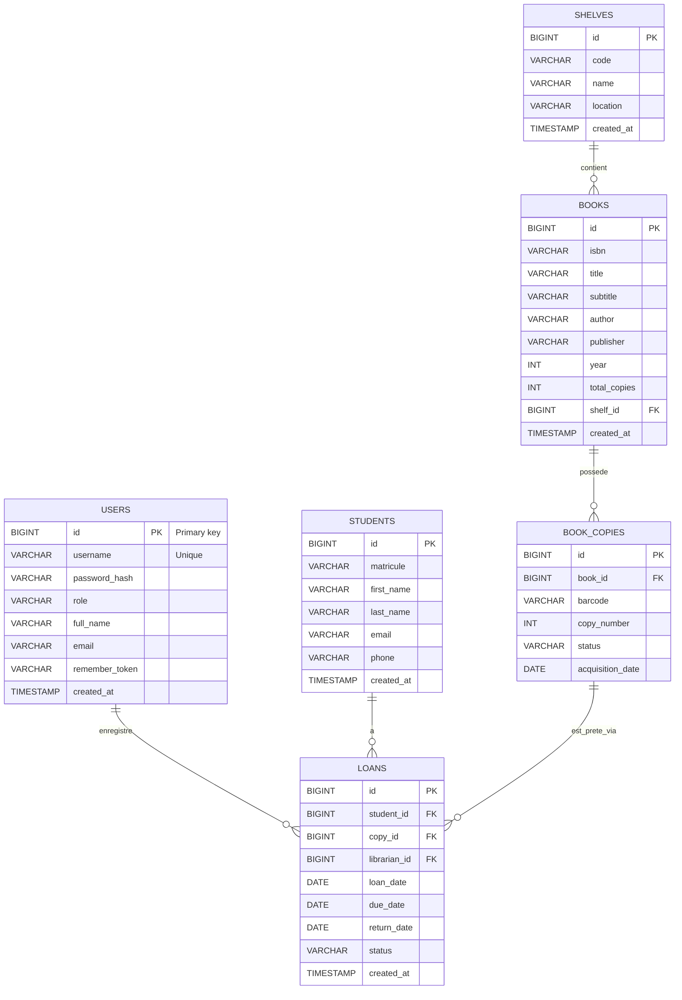

# Modèle Entité-Association (relationnel) — LibraSys

Ce document décrit le modèle entité-association traduisible en schéma relationnel pour l'application LibraSys. Les choix suivent la structure observée (students, books, shelves, loans, login/users, dashboard). Utiliser ces DDL comme point de départ (adapter types selon SGBD : PostgreSQL, MySQL, H2...).

---

## Entités et attributs (relationnel)

1) users (gestion des comptes : librarians/admins)
- id BIGINT PRIMARY KEY
- username VARCHAR(100) UNIQUE NOT NULL
- password_hash VARCHAR(255) NOT NULL -- stocker un hash (bcrypt/PBKDF2)
- role VARCHAR(20) NOT NULL -- 'LIBRARIAN' | 'ADMIN'
- full_name VARCHAR(200)
- email VARCHAR(200)
- remember_token VARCHAR(255) NULL
- created_at TIMESTAMP DEFAULT CURRENT_TIMESTAMP
- updated_at TIMESTAMP

2) students
- id BIGINT PRIMARY KEY
- matricule VARCHAR(50) UNIQUE -- numero etudiant
- first_name VARCHAR(100)
- last_name VARCHAR(100)
- email VARCHAR(200)
- phone VARCHAR(50)
- created_at TIMESTAMP

3) shelves (rayons)
- id BIGINT PRIMARY KEY
- code VARCHAR(50) UNIQUE NOT NULL
- name VARCHAR(200)
- location VARCHAR(200) -- ex: "Batiment A / 2eme etag"
- created_at TIMESTAMP

4) books
- id BIGINT PRIMARY KEY
- isbn VARCHAR(20) NULL
- title VARCHAR(500) NOT NULL
- subtitle VARCHAR(500) NULL
- author VARCHAR(300)
- publisher VARCHAR(200)
- year INT
- total_copies INT DEFAULT 0 -- denormalisé pour performance
- shelf_id BIGINT NULL REFERENCES shelves(id)
- created_at TIMESTAMP

5) book_copies (exemplaires physiques)
- id BIGINT PRIMARY KEY
- book_id BIGINT NOT NULL REFERENCES books(id) ON DELETE CASCADE
- barcode VARCHAR(100) UNIQUE -- ou code interne
- copy_number INT NOT NULL -- 1..N pour ce livre
- status VARCHAR(20) NOT NULL -- 'AVAILABLE','LOANED','LOST','DAMAGED'
- acquisition_date DATE

6) loans (prets)
- id BIGINT PRIMARY KEY
- student_id BIGINT NOT NULL REFERENCES students(id) ON DELETE RESTRICT
- copy_id BIGINT NOT NULL REFERENCES book_copies(id) ON DELETE RESTRICT
- librarian_id BIGINT NOT NULL REFERENCES users(id)
- loan_date DATE NOT NULL
- due_date DATE NOT NULL
- return_date DATE NULL
- status VARCHAR(20) NOT NULL -- 'EN_COURS','RETARD','RETOURNE'
- created_at TIMESTAMP DEFAULT CURRENT_TIMESTAMP
- updated_at TIMESTAMP

---

## Contraintes et index suggérés
- UNIQUE(username) sur users
- UNIQUE(matricule) sur students
- INDEX(book_id) et INDEX(shelf_id) sur books
- INDEX(student_id), INDEX(copy_id), INDEX(status) sur loans
- CHECK sur status/role si SGBD le permet, sinon valeurs contrôlées côté application

Exemple CHECK (Postgres):
- CHECK (role IN ('LIBRARIAN','ADMIN'))
- CHECK (status IN ('AVAILABLE','LOANED','LOST','DAMAGED'))

---

## Relations (cardinalités)
- users(1) -- (N) loans : un bibliothécaire peut enregistrer plusieurs prêts (1,N)
- students(1) -- (N) loans : un étudiant peut avoir plusieurs prêts historiques (1,N)
- books(1) -- (N) book_copies : un livre a plusieurs exemplaires (1,N)
- book_copies(1) -- (N) loans : un exemplaire peut être prêté plusieurs fois dans le temps (historique) (1,N)
- shelves(1) -- (N) books : un rayon contient plusieurs livres (1,N)

Contraintes métiers importantes :
- Un exemplaire (book_copy) ne doit être actif dans qu'un seul prêt "EN_COURS" à la fois. Implémenter par transaction et vérification application/DB (p.ex. drapeaux ou SELECT FOR UPDATE).
- Lors d'un retour, mettre à jour return_date et status du prêt, et remettre book_copies.status = 'AVAILABLE'.

---

## DDL exemple (PostgreSQL-like)

CREATE TABLE users (
  id BIGSERIAL PRIMARY KEY,
  username VARCHAR(100) NOT NULL UNIQUE,
  password_hash VARCHAR(255) NOT NULL,
  role VARCHAR(20) NOT NULL CHECK (role IN ('LIBRARIAN','ADMIN')),
  full_name VARCHAR(200),
  email VARCHAR(200),
  remember_token VARCHAR(255),
  created_at TIMESTAMP DEFAULT CURRENT_TIMESTAMP,
  updated_at TIMESTAMP
);

CREATE TABLE students (
  id BIGSERIAL PRIMARY KEY,
  matricule VARCHAR(50) UNIQUE,
  first_name VARCHAR(100),
  last_name VARCHAR(100),
  email VARCHAR(200),
  phone VARCHAR(50),
  created_at TIMESTAMP
);

CREATE TABLE shelves (
  id BIGSERIAL PRIMARY KEY,
  code VARCHAR(50) NOT NULL UNIQUE,
  name VARCHAR(200),
  location VARCHAR(200),
  created_at TIMESTAMP
);

CREATE TABLE books (
  id BIGSERIAL PRIMARY KEY,
  isbn VARCHAR(20),
  title VARCHAR(500) NOT NULL,
  subtitle VARCHAR(500),
  author VARCHAR(300),
  publisher VARCHAR(200),
  year INT,
  total_copies INT DEFAULT 0,
  shelf_id BIGINT REFERENCES shelves(id),
  created_at TIMESTAMP
);

CREATE TABLE book_copies (
  id BIGSERIAL PRIMARY KEY,
  book_id BIGINT NOT NULL REFERENCES books(id) ON DELETE CASCADE,
  barcode VARCHAR(100) UNIQUE,
  copy_number INT NOT NULL,
  status VARCHAR(20) NOT NULL CHECK (status IN ('AVAILABLE','LOANED','LOST','DAMAGED')),
  acquisition_date DATE
);

CREATE TABLE loans (
  id BIGSERIAL PRIMARY KEY,
  student_id BIGINT NOT NULL REFERENCES students(id),
  copy_id BIGINT NOT NULL REFERENCES book_copies(id),
  librarian_id BIGINT NOT NULL REFERENCES users(id),
  loan_date DATE NOT NULL,
  due_date DATE NOT NULL,
  return_date DATE,
  status VARCHAR(20) NOT NULL CHECK (status IN ('EN_COURS','RETARD','RETOURNE')),
  created_at TIMESTAMP DEFAULT CURRENT_TIMESTAMP,
  updated_at TIMESTAMP
);

-- Indexes supplémentaires
CREATE INDEX idx_loans_student ON loans(student_id);
CREATE INDEX idx_loans_copy ON loans(copy_id);
CREATE INDEX idx_books_shelf ON books(shelf_id);

---

## Normalisation & remarques
- Le schéma est en 3NF : pas de redondance fonctionnelle sauf `books.total_copies` (dénormalisation pour lecture rapide). `total_copies` peut être calculé par COUNT(book_copies).
- Les énumérations sont gérées par CHECK ou tables de référence si besoin d'extensibilité (p.ex. loan_status table).
- Auth : stocker uniquement des hash de mot de passe et utiliser salage + algorithme robuste. Pour demo, user fictif 'librarian' peut être inséré avec un hash.
- Transactions nécessaires pour opérations critiques (prêt/retour) afin d'éviter conditions de concurrence.

---

## Exemple d'insertion pour démo (user fictif)
INSERT INTO users (username, password_hash, role, full_name) VALUES
('librarian', '<bcrypt-hash-of-password>', 'LIBRARIAN', 'Demo Librarian');

---

## Diagramme simple (ASCII)

USERS (1) --- (N) LOANS
STUDENTS (1) --- (N) LOANS
BOOK_COPIES (1) --- (N) LOANS
BOOKS (1) --- (N) BOOK_COPIES
SHELVES (1) --- (N) BOOKS

---

Si souhaité, génération d'un diagramme Mermaid ou export DDL complet pour un SGBD précis (Postgres / MySQL / SQLite).

## Diagramme Mermaid

Notes:
- PK = Primary Key, FK = Foreign Key.
- Cardinalités : || = 1, o{ = many. Exemple USERS ||--o{ LOANS signifie 1 utilisateur enregistre plusieurs prêts.
- Mermaid erDiagram a des limitations (affichage des types et contraintes peut varier). Utiliser ce diagramme pour documentation; adapter si besoin pour outils de modélisation.
